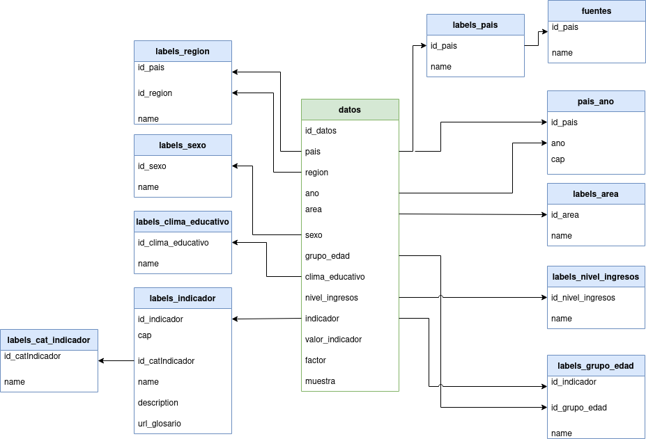

# 🎨 HackingEDPlanningV2-Challenge6

Through its web platform SITEAL, IIEP provides a set of educational indicators from Latin American countries disaggregated by socio-economic variables. This data is **highly relevant for officers of the Ministries of Education of the region, as well as for researchers and developers** interested in statistical trends. However, the output tables of the current interface are not visually attractive, which makes them hard to interpret and leads to under-utilization. 
This challenge proposes to create a minimum working example or a mock-up of proposed improvements for the data visualization, with the aim of fostering a greater and better use of the data. This entails making the output tables more visually appealing and user friendly and offering graphs that allow the visualization of long-term trends and the comparison between indicators. 


# Data

The data can be found in the `data` folder. There is one CSV file for each table.

- `datos.csv` is the main table that contains the indicator values for each cut-off variable;
- each `labels_*.csv` file contains the categories of each cut-off variable. Although the cut-off variables are the same, the categories differ by country;
- `pais_ano.csv` is a table indicating which years and "chapter" of data are available for each country;
- `fuentes.csv` lists the source of the data for each country.

You can find the data model with relations between each table below:


\
The table `datos` has the following fields:
- **id_datos**: ID of the record;
- **pais, region, ano, area, sexo, grupo_edad, clima_educativo,nivel_ingresos**: To which cutoffs the record corresponds. Except for `ano`, the values of the columns are IDs bound to each `labels_*` tables. Each record is the value of an indicator for a subset of the population corresponding to the intersection of all these cutoffs. Note that each indicator, depending on the chapter to which it corresponds, uses different cut-off variables. In other words, in some records some cutoff variables will be 0, which means that this indicator does not use it.
- **indicador**: The ID of the indicator;
- **valor_indicador**: The value of the indicator for that subset of the population corresponding to the intersection of all the cutoffs.
- **factor**: A weighting factor relative to the percentage of the country's population that corresponds to the subset of the population identified by this record.
- **muestra**: The sample size of the subset of the population that was used to construct the indicator value. If in the results table a cell corresponds to a very small sample (summing the samples of all the records that were used to generate that cell) a warning is displayed that the value may not be representative.


# Compute the indicators

To calculate the indicators, there is a little bit of work.

For each row of the table, all the records corresponding to that crossing are summed.

For example: if I select the filters `name_indicador="Tasa de asistencia escolar por edad"`, `ano=2000` and `pays=Argentina`, 
I will sum the remaining records regardless of region, area, educational level, income, etc..

Given all the records I will calculate :


\
Here is an example of code with the above filters and grouping by the `region` and `sexo` written in Python and the Pandas library:
```py
#data df holds the name of each cut-off variable along with the indicators values
(data_df[
    (data_df.id_indicador == 1) 
    & (data_df.name_pais == "Argentina") 
    & (data_df.ano == 2000)
]
.groupby(["name_region","name_sexo"])
.apply(
    lambda x: (x.valor_indicador * x.factor).sum() / x.factor.sum()
))
```
It will output:
```
name_region  name_sexo    value
Cuyo         F            92.772666
             M            92.596198
GBA          F            95.550191
             M            93.866597
NEA          F            90.699658
             M            90.797952
NOA          F            92.361585
             M            92.078883
Pampeana     F            93.687275
             M            93.538756
Patagonia    F            94.748224
             M            94.416389
```

# Resources

To get you started quickly and help you with this challenge, we have prepared a non-exhaustive list of inspiring data visualizations and tools on this Notion page : **[Inspiring visualizations and Toolbox](https://fabiencazals.notion.site/Inspiring-visualizations-and-Toolbox-3797702146d443078ac6413b33203c00)**.

However, feel free to use the tools you prefer to succeed in this challenge!